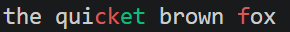
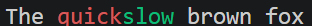
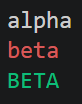

# jsdiffr

[](https://github.com/KyleHaynes/jsdiffr/actions)
[](https://github.com/KyleHaynes/jsdiffr)


A faithful R port of the [jsdiff](https://github.com/kpdecker/jsdiff)
JavaScript library. Compute differences between two pieces of text or two
sequences at the level of characters, words, lines, sentences, CSS tokens, JSON
values, or arbitrary arrays, using Myers' O(ND) difference algorithm. The core
diff loop is implemented in C++ (via Rcpp) for speed on large inputs.

The output of every diff function matches jsdiff 9.0.0 exactly: the test suite
checks > 4,000 randomly generated inputs against the real library.

## Installation

Requires a C++ compiler (Rtools on Windows).

```r
# install.packages("remotes")
remotes::install_github("KyleHaynes/anthropic_diff")
```

## Quick start

```r
library(jsdiffr)

diff_chars("the quick brown fox", "the quiet brown ox")
```


```r
diff_words("The quick brown fox", "The slow brown fox")
```


```r
diff_lines("alpha\nbeta\n", "alpha\nBETA\n")
```


Each function returns a `data.table` of change objects with columns `value`,
`added`, `removed`, and `count`. Printing a diff colours additions green and
deletions red.

## HTML output and Shiny

`diff_to_html()` renders a diff as HTML spans (`.jsdiff-added` / `.jsdiff-removed`),
and `diff_css_default()` returns matching CSS. This makes it easy to show a diff
in an R Markdown report or a Shiny app.

```r
diff_to_html(diff_words("the cat sat", "the dog sat"))
#> <div class="jsdiff"><pre class="jsdiff-pre">
#>   <span class="jsdiff-context">the </span>
#>   <span class="jsdiff-removed">cat</span>
#>   <span class="jsdiff-added">dog</span>
#>   <span class="jsdiff-context"> sat</span>
#> </pre></div>
#> (shown indented here for readability; the real output is a single line)
```

A minimal Shiny app that diffs two text areas:

```r
library(shiny)
library(jsdiffr)

ui <- fluidPage(
  tags$head(tags$style(HTML(diff_css_default()))),
  titlePanel("jsdiffr live diff"),
  fluidRow(
    column(6, textAreaInput("old", "Old", "the quick brown fox\njumps over\n",
                            rows = 8, width = "100%")),
    column(6, textAreaInput("new", "New", "the slow brown fox\nleaps over\n",
                            rows = 8, width = "100%"))
  ),
  hr(),
  uiOutput("diff")
)

server <- function(input, output) {
  output$diff <- renderUI({
    HTML(diff_to_html(diff_lines(input$old, input$new)))
  })
}

shinyApp(ui, server)
```

A interactive Shiny app that diffs two text areas live:

```r
library(shiny)
library(jsdiffr)

shiny::runApp(system.file("shiny/address_diff", package = "jsdiffr"))
```


Use `diff_words()` / `diff_chars()` instead of `diff_lines()` for word- or
character-level highlighting.

## Features

* **Diffing**: `diff_chars`, `diff_words`, `diff_words_with_space`,
  `diff_lines`, `diff_trimmed_lines`, `diff_sentences`, `diff_css`, `diff_json`,
  `diff_arrays`.
* **Patches**: `structured_patch`, `create_patch`, `create_two_files_patch`,
  `format_patch`, `parse_patch`, `apply_patch`, `apply_patches`, `reverse_patch`,
  plus Unix/Windows line-ending helpers.
* **Converters**: `convert_changes_to_xml`, `convert_changes_to_dmp`.
* **Display**: ANSI-coloured console printing and `diff_to_html()` for Shiny /
  R Markdown (with `diff_css_default()`).
* `camelCase` aliases (`diffChars`, `createPatch`, ...) for users porting JS.

## Performance

A line diff of two 50,000-line files runs in about 0.25s; creating and applying
the corresponding patch takes under a second combined.

## Credits

Ported from [jsdiff](https://github.com/kpdecker/jsdiff) by Kevin Decker,
which is distributed under the BSD 3-Clause license.
