# jsdiffr — Usage Examples

A port of the JavaScript [jsdiff](https://github.com/kpdecker/jsdiff) library to R.
This document walks through every major area of the API with runnable examples.

---

## Table of Contents

1. [String Diffs](#1-string-diffs)
   - [diff_chars](#diffchars)
   - [diff_words](#diffwords)
   - [diff_words_with_space](#diffwordswithspace)
   - [diff_lines](#difflines)
   - [diff_trimmed_lines](#difftrimmedlines)
   - [diff_sentences](#diffsentences)
   - [diff_css](#diffcss)
2. [Array Diffs](#2-array-diffs)
3. [JSON Diffs](#3-json-diffs)
4. [Patch Creation](#4-patch-creation)
   - [structured_patch](#structuredpatch)
   - [format_patch](#formatpatch)
   - [create_patch](#createpatch)
   - [create_two_files_patch](#createtwofilespatch)
5. [Patch Parsing](#5-patch-parsing)
6. [Patch Application](#6-patch-application)
   - [apply_patch](#applypatch)
   - [Fuzzy matching with fuzz_factor](#fuzzy-matching-with-fuzz_factor)
   - [apply_patches — multi-file callback API](#applypatches--multi-file-callback-api)
7. [Patch Reversal](#7-patch-reversal)
8. [HTML Output](#8-html-output)
   - [diff_to_html](#diffthtml)
   - [diff_html — three-column browser view](#diffhtml--three-column-browser-view)
9. [Format Conversion](#9-format-conversion)
   - [convert_changes_to_xml](#convertchangestoxml)
   - [convert_changes_to_dmp](#convertchangestodmp)
10. [camelCase Aliases](#10-camelcase-aliases)
11. [Advanced Options](#11-advanced-options)

---

## 1. String Diffs

All string diff functions return a `jsdiff_changes` object: a `data.table` with
columns `value` (character), `added` (logical), `removed` (logical), and
`count` (integer). Printing uses ANSI colour when the terminal supports it
(green for additions, red for removals).

### diff_chars

Compares two strings **character by character**. Best for short strings where
every keystroke matters (passwords, IDs, codes).

```r
library(jsdiffr)

# Basic character diff
diff_chars("Hello World", "Hello R World")
```
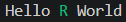

```r
# The structure
str(diff_chars("Hello World", "Hello R World"))
# Classes 'jsdiff_changes', 'data.table' and 'data.frame':        3 obs. of  4 variables:
#  $ value  : chr  "Hello " "R " "World"
#  $ added  : logi  FALSE TRUE FALSE
#  $ removed: logi  FALSE FALSE FALSE
#  $ count  : int  6 2 5
```

```r
# Case-insensitive comparison
diff_chars("Hello", "hello", ignore_case = TRUE)
# No changes — treated as equal
```

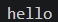

```r
diff_chars("Hello", "hello", ignore_case = FALSE)
```


```r
# Bail out early on very large diffs
result <- diff_chars(strrep("a", 10000), strrep("b", 10000), max_edit_length = 100)
is.null(result)  # TRUE — edit distance exceeded threshold
```

### diff_words

Compares two strings **word by word**. Whitespace between words is preserved
in the output but ignored when deciding equality — use `diff_words_with_space`
if whitespace matters.

```r
diff_words("The quick brown fox", "The slow brown fox")
```
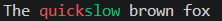

```r
# Sentence with multiple word changes
diff_words(
  "I went to the store yesterday",
  "I went to the market today"
)
```
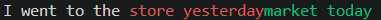

```r
# Case-insensitive word matching
diff_words("The Cat", "the cat", ignore_case = TRUE)
# No changes
```
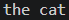

```r
# Unicode words work too
diff_words("café au lait", "café noir")
```
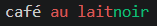


### diff_words_with_space

Like `diff_words` but treats runs of whitespace as tokens in their own right,
so changing `"a  b"` to `"a b"` (double space → single) shows a diff.

```r
str(diff_words_with_space("a  b  c", "a b c"))
# Classes 'jsdiff_changes', 'data.table' and 'data.frame':        7 obs. of  4 variables:
#  $ value  : chr  "a" "  " " " "b" ...
#  $ added  : logi  FALSE FALSE TRUE FALSE FALSE TRUE ...
#  $ removed: logi  FALSE TRUE FALSE FALSE TRUE FALSE ...
#  $ count  : int  1 1 1 1 1 1 1
```

### diff_lines

Compares two multi-line strings **line by line**. Each value includes its
trailing `\n`, making it easy to reconstruct either side.

```r
old <- "line one\nline two\nline three\n"
new <- "line one\nline TWO\nline three\nline four\n"

diff_lines(old, new)
```
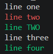

```r
# Ignore leading/trailing whitespace per line
diff_lines(
  "  hello  \n  world  \n",
  "hello\nworld\n",
  ignore_whitespace = TRUE
)
# No changes — only internal content compared

# Treat newline itself as a separate token
diff_lines("a\nb\n", "a\n\nb\n", newline_is_token = TRUE)
# Shows the inserted blank line clearly

# Normalise Windows line endings before diffing
diff_lines("a\r\nb\r\n", "a\nb\n", strip_trailing_cr = TRUE)
# No changes
```

### diff_trimmed_lines

Convenience wrapper: `diff_lines(..., ignore_whitespace = TRUE)`.

```r
diff_trimmed_lines(
  "  function foo() {\n    return 1;\n  }\n",
  "function foo() {\n  return 1;\n}\n"
)
# No changes — indentation differences ignored
```

### diff_sentences

Splits on sentence-ending punctuation (`.`, `!`, `?`) and compares sentence
by sentence. Good for diffing prose.

```r
old_text <- "The cat sat on the mat. The dog ran away. The bird flew high."
new_text <- "The cat sat on the mat. The bird flew high."

diff_sentences(old_text, new_text)
```
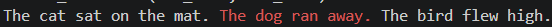


### diff_css

Tokenises CSS by braces `{}`, colons `:`, semicolons `;`, and commas `,`
before comparing. Changes to individual property values are isolated.

```r
old_css <- "a { color: red; font-size: 12px; }"
new_css <- "a { color: blue; font-size: 14px; font-weight: bold; }"

diff_css(old_css, new_css)
```
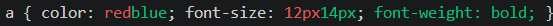

---

## 2. Array Diffs

`diff_arrays` compares two **vectors or lists** element-wise. Unlike the string
diffs, the `value` column is a **list** of sub-sequences rather than a
concatenated string.

```r
# Integer vectors
d <- diff_arrays(c(1, 2, 3, 4, 5), c(1, 2, 99, 4, 5))
d$value   # list: [[1,2]], [[3]], [[99]], [[4,5]]
d$removed # FALSE  TRUE FALSE FALSE
d$added   # FALSE FALSE  TRUE FALSE

# Character vectors
diff_arrays(c("a", "b", "c", "d"), c("a", "c", "d", "e"))
#      value added removed count
# 1:      a  FALSE   FALSE     1
# 2:      b  FALSE    TRUE     1
# 3:    c,d  FALSE   FALSE     2
# 4:      e   TRUE   FALSE     1

# Custom comparator — case-insensitive string equality
diff_arrays(
  c("Apple", "Banana", "Cherry"),
  c("apple", "banana", "CHERRY"),
  comparator = function(a, b) tolower(a) == tolower(b)
)
#                  value  added removed count
# 1: apple,banana,CHERRY  FALSE   FALSE     3

# List of complex objects — uses identical() by default
diff_arrays(
  list(list(id = 1, val = "a"), list(id = 2, val = "b")),
  list(list(id = 1, val = "a"), list(id = 2, val = "B"))
)
#        value  added removed count
# 1: <list[1]>  FALSE   FALSE     1
# 2: <list[1]>  FALSE    TRUE     1
# 3: <list[1]>   TRUE   FALSE     1

# Numeric tolerance comparator
diff_arrays(
  c(1.0, 2.0, 3.0),
  c(1.0001, 2.0, 3.0005),
  comparator = function(a, b) abs(a - b) < 0.001
)
#                   value  added removed count
# 1: 1.0001,2.0000,3.0005  FALSE   FALSE     3
```

---

## 3. JSON Diffs

`diff_json` serialises each input to canonical pretty-printed JSON (object keys
sorted alphabetically) then diffs line by line. A pre-serialised JSON string is
used as-is. Lines differing only by a trailing comma are treated as equal,
matching jsdiff's JavaScript behaviour.

```r
# Nested objects
old_obj <- list(name = "Alice", age = 30, scores = c(95, 87, 92))
new_obj <- list(name = "Alice", age = 31, scores = c(95, 87, 99))

diff_json(old_obj, new_obj)
# Shows "age" line changed (30 → 31) and last score changed (92 → 99)
```
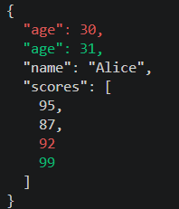

```r
# Key order doesn't matter — keys are sorted before comparison
diff_json(
  list(z = 1, a = 2),
  list(a = 2, z = 1)
)
# No changes

# Adding / removing keys
diff_json(
  list(x = 1, y = 2),
  list(x = 1, y = 2, z = 3)
)
# Shows z line added
```
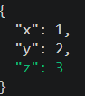

```r
# NULL / NA handling
diff_json(list(a = 1, b = NULL), list(a = 1, b = NA))
# Both serialise to null by default

# Custom undefined replacement
diff_json(
  list(a = 1, b = NULL),
  list(a = 1, b = 0),
  undefined_replacement = 0
)
# No changes — NULL replaced with 0

# Pre-serialised JSON strings passed directly
diff_json(
  '{"a": 1, "b": 2}',
  '{"a": 1, "b": 3}'
)
```
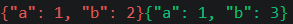

---

## 4. Patch Creation

Patches are represented as `jsdiff_patch` objects (named lists with fields
`old_file_name`, `new_file_name`, `old_header`, `new_header`, `hunks`).

### structured_patch

Returns a `jsdiff_patch` object you can inspect, modify, reverse, or pass to
`format_patch`.

```r
old_str <- "first line\nsecond line\nthird line\nfourth line\n"
new_str <- "first line\n2nd line\nthird line\nfourth line\n"

patch <- structured_patch("file.txt", "file.txt", old_str, new_str)

class(patch)           # "jsdiff_patch"
patch$old_file_name    # "file.txt"
patch$new_file_name    # "file.txt"
length(patch$hunks)    # 1
patch$hunks[[1]]$lines
# [1] " first line" "-second line" "+2nd line" " third line" " fourth line"

# Control context lines (default 4)
structured_patch("f", "f", old_str, new_str, context = 1)
# Hunk contains only 1 line of context on each side

# Ignore leading/trailing whitespace
structured_patch(
  "f", "f",
  "  hello\n  world\n",
  "hello\nworld\n",
  ignore_whitespace = TRUE
)
# No hunks — files are equal under whitespace-ignoring comparison
```

### format_patch

Converts a `jsdiff_patch` (or list of them) to a unified diff string.

```r
patch <- structured_patch(
  "old.txt", "new.txt",
  "line 1\nline 2\nline 3\n",
  "line 1\nLINE 2\nline 3\n"
)

cat(format_patch(patch))
# ===================================================================
# --- old.txt
# +++ new.txt
# @@ -1,3 +1,3 @@
#  line 1
# -line 2
# +LINE 2
#  line 3

# Strip the Index / underline headers
cat(format_patch(patch, include_index = FALSE, include_underline = FALSE))
# --- old.txt
# +++ new.txt
# @@ -1,3 +1,3 @@
#  line 1
# -line 2
# +LINE 2
#  line 3

# Strip file headers too (just the hunks)
cat(format_patch(patch, include_index = FALSE, include_underline = FALSE,
                 include_file_headers = FALSE))
# @@ -1,3 +1,3 @@
#  line 1
# -line 2
# +LINE 2
#  line 3

# Format a list of patches at once
p2 <- structured_patch("b.txt", "b.txt", "foo\n", "bar\n")
cat(format_patch(list(patch, p2)))
# ===================================================================
# --- old.txt
# +++ new.txt
# @@ -1,3 +1,3 @@
#  line 1
# -line 2
# +LINE 2
#  line 3

# Index: b.txt
# ===================================================================
# --- b.txt
# +++ b.txt
# @@ -1,1 +1,1 @@
# -foo
# +bar
```

### create_patch

One-step convenience: `structured_patch` + `format_patch` for a single file
(same name on both sides).

```r
cat(create_patch(
  file_name = "config.R",
  old_str   = 'debug <- FALSE\nverbose <- TRUE\n',
  new_str   = 'debug <- TRUE\nverbose <- TRUE\n'
))
# Index: config.R
# ===================================================================
# --- config.R
# +++ config.R
# @@ -1,2 +1,2 @@
# -debug <- FALSE
# +debug <- TRUE
#  verbose <- TRUE

# With timestamps in the header
cat(create_patch(
  "script.R",
  old_str    = "x <- 1\n",
  new_str    = "x <- 2\n",
  old_header = "2024-01-01 10:00:00",
  new_header = "2024-06-15 14:30:00"
))
# Index: script.R
# ===================================================================
# --- script.R    2024-01-01 10:00:00
# +++ script.R    2024-06-15 14:30:00
# @@ -1,1 +1,1 @@
# -x <- 1
# +x <- 2

# Narrow context window
long_file <- paste(paste0("line ", 1:20), collapse = "\n")
modified   <- sub("line 10", "LINE 10", long_file)
cat(create_patch("big.txt", long_file, modified, context = 2))
# Index: big.txt
# ===================================================================
# --- big.txt
# +++ big.txt
# @@ -8,5 +8,5 @@
#  line 8
#  line 9
# -line 10
# +LINE 10
#  line 11
#  line 12
```

### create_two_files_patch

Like `create_patch` but allows different filenames on each side — useful for
showing renames or before/after states.

```r
cat(create_two_files_patch(
  old_file_name = "src/utils.R",
  new_file_name = "src/helpers.R",
  old_str       = "helper <- function(x) x + 1\n",
  new_str       = "helper <- function(x, y = 0) x + y + 1\n"
))
# ===================================================================
# --- src/utils.R
# +++ src/helpers.R
# @@ -1,1 +1,1 @@
# -helper <- function(x) x + 1
# +helper <- function(x, y = 0) x + y + 1
```

---

## 5. Patch Parsing

`parse_patch` reads a unified diff string (including Git-format patches) and
returns a list of `jsdiff_patch` objects — one per file in the diff.

```r
uni_diff <- "
Index: file.txt
===================================================================
--- file.txt
+++ file.txt
@@ -1,3 +1,3 @@
 line one
-line two
+line 2
 line three
"

patches <- parse_patch(uni_diff)
length(patches)              # 1
p <- patches[[1]]
p$old_file_name              # "file.txt"
p$new_file_name              # "file.txt"
length(p$hunks)              # 1
p$hunks[[1]]$old_start       # 1
p$hunks[[1]]$old_lines       # 3
p$hunks[[1]]$lines
# [1] " line one" "-line two" "+line 2" " line three"

# Round-trip: create → format → parse → format should be identical
original_patch_str <- create_patch("f.txt", "old\ncontent\n", "new\ncontent\n")
reparsed <- parse_patch(original_patch_str)
cat(format_patch(reparsed))  # same as original_patch_str
# Index: f.txt
# ===================================================================
# --- f.txt
# +++ f.txt
# @@ -1,2 +1,2 @@
# -old
# +new
#  content

# Multi-file patch
multi <- paste0(
  create_patch("a.txt", "hello\n", "Hello\n"),
  create_patch("b.txt", "foo\n",   "bar\n")
)
patches <- parse_patch(multi)
length(patches)  # 2
patches[[1]]$old_file_name  # "a.txt"
patches[[2]]$old_file_name  # "b.txt"

# Git-format patch (produced by git diff)
git_diff <- '
diff --git a/README.md b/README.md
--- a/README.md
+++ b/README.md
@@ -1,2 +1,2 @@
-# Old Title
+# New Title
 Some content.
'
git_patches <- parse_patch(git_diff)
git_patches[[1]]$is_git     # TRUE
git_patches[[1]]$old_file_name  # "a/README.md"
```

---

## 6. Patch Application

### apply_patch

Applies a patch to a source string. Returns the patched string, or `FALSE` if
the patch cannot be applied. Accepts a unified diff string, a `jsdiff_patch`
object, or a single-element list.

```r
source_text <- "line one\nline two\nline three\n"

# From a patch string
patch_str <- create_patch("f", source_text, "line one\nline 2\nline three\n")
result <- apply_patch(source_text, patch_str)
cat(result)
# line one
# line 2
# line three

# From a structured patch object
p <- structured_patch("f", "f", source_text, "line one\nline 2\nline three\n")
result <- apply_patch(source_text, p)

# Returns FALSE when patch does not match source
apply_patch("completely different text\n", patch_str)  # FALSE

# Round-trip verification
original <- "alpha\nbeta\ngamma\n"
modified <- "alpha\nBETA\ngamma\n"
patch    <- create_patch("f", original, modified)
back     <- apply_patch(original, patch)
identical(back, modified)  # TRUE
```

### Fuzzy matching with fuzz_factor

`fuzz_factor` lets `apply_patch` tolerate context lines that no longer exactly
match — useful when applying a patch to a slightly different version of a file.

```r
original <- paste(paste0("line ", 1:10), collapse = "\n")
modified  <- sub("line 5", "LINE FIVE", original)
patch     <- create_patch("f", original, modified)

# Simulate the source having drifted (extra line inserted elsewhere)
drifted <- sub("line 3", "line 3\nextra line", original)

# Strict application fails
apply_patch(drifted, patch)             # FALSE

# Fuzzy application succeeds
apply_patch(drifted, patch, fuzz_factor = 2)  # patched string

# Custom line comparator (case-insensitive context matching)
apply_patch(
  toupper(source_text),
  patch_str,
  compare_line = function(line_no, line, op, patch_content) {
    tolower(line) == tolower(patch_content)
  }
)
# [1] "LINE ONE\nline 2\nLINE THREE\n"
```

### apply_patches — multi-file callback API

`apply_patches` processes a multi-file patch via callbacks. This mirrors the
original jsdiff JavaScript API and is useful when patching files stored in a
named list, environment, or on disk.

```r
# In-memory store
sources <- list(
  "a.txt" = "hello\nworld\n",
  "b.txt" = "foo\nbar\nbaz\n"
)

combined_patch <- paste0(
  create_patch("a.txt", sources[["a.txt"]], "hello\nearth\n"),
  create_patch("b.txt", sources[["b.txt"]], "foo\nBAR\nbaz\n")
)

results <- list()
apply_patches(
  combined_patch,
  load_file = function(patch_obj) sources[[patch_obj$old_file_name]],
  patched   = function(patch_obj, content) {
    results[[patch_obj$new_file_name]] <<- content
  },
  complete  = function(err = NULL) {
    if (!is.null(err)) stop(err)
    message("All patches applied.")
  }
)

cat(results[["a.txt"]])
# hello
# earth
cat(results[["b.txt"]])
# foo
# BAR
# baz

# Pass extra options (fuzz_factor) via ...
apply_patches(
  combined_patch,
  load_file = function(p) sources[[p$old_file_name]],
  patched   = function(p, content) results[[p$new_file_name]] <<- content,
  fuzz_factor = 1
)
```

---

## 7. Patch Reversal

`reverse_patch` flips a patch so applying it **undoes** the original change.
Old and new sides are swapped, `+` and `-` lines are exchanged, and Git-format
fields (`is_create`/`is_delete`, modes, prefixes) are handled correctly.

```r
original <- "first line\nsecond line\nthird line\n"
modified <- "first line\n2nd line\nthird line\n"

patch    <- structured_patch("file.txt", "file.txt", original, modified)
applied  <- apply_patch(original, patch)
cat(applied)
# first line
# 2nd line
# third line

rev_patch <- reverse_patch(patch)
restored  <- apply_patch(applied, rev_patch)
cat(restored)
# first line
# second line
# third line

identical(original, restored)  # TRUE

# Works with lists of patches too (order is also reversed)
p1 <- structured_patch("a.txt", "a.txt", "old a\n", "new a\n")
p2 <- structured_patch("b.txt", "b.txt", "old b\n", "new b\n")
rev_list <- reverse_patch(list(p1, p2))
# rev_list[[1]] reverses p2, rev_list[[2]] reverses p1

# Useful for "undo" stacks
undo_stack <- list()
apply_change <- function(src, old, new, fname) {
  p <- structured_patch(fname, fname, old, new)
  undo_stack[[length(undo_stack) + 1L]] <<- p
  apply_patch(src, p)
}
undo_last <- function(current) {
  p <- undo_stack[[length(undo_stack)]]
  undo_stack[[length(undo_stack)]] <<- NULL
  apply_patch(current, reverse_patch(p))
}

v1 <- "a\nb\nc\n"
v2 <- apply_change(v1, v1, "a\nB\nc\n", "f")
v3 <- apply_change(v2, v2, "a\nB\nC\n", "f")
undo_last(v3)  # back to v2: "a\nB\nc\n"
```

---

## 8. HTML Output

### diff_to_html

Converts a `jsdiff_changes` object to an HTML fragment. Additions are wrapped
in `<span class="jsdiff-added">`, removals in `<span class="jsdiff-removed">`,
and unchanged text in `<span class="jsdiff-context">`.

```r
# Basic usage
ch <- diff_words("The cat sat on the mat", "The cat sat on the rug")
html_snippet <- diff_to_html(ch)
# <div class="jsdiff"><pre class="jsdiff-pre">
#   <span class="jsdiff-context">The cat sat on the </span>
#   <span class="jsdiff-removed">mat</span>
#   <span class="jsdiff-added">rug</span>
# </pre></div>

# Without outer wrappers — embed in your own structure
diff_to_html(ch, wrap = FALSE, pre = FALSE)

# Without <pre> — inline in flowing text
diff_to_html(ch, pre = FALSE)

# Embed in an R Markdown document
# ```{r, results='asis'}
# cat("<style>", diff_css_default(), "</style>")
# cat(diff_to_html(diff_words("old text here", "new text here")))
# ```

# Full standalone HTML page (manual)
css  <- diff_css_default()
body <- diff_to_html(diff_lines("line a\nline b\n", "line a\nline B\n"))
html <- paste0(
  "<!DOCTYPE html><html><head><meta charset='utf-8'>",
  "<style>", css, "</style></head><body>", body, "</body></html>"
)
tmp <- tempfile(fileext = ".html")
writeLines(html, tmp)
browseURL(tmp)
```
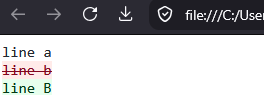


### diff_html — three-column browser view

`diff_html` compares two equal-length character vectors and renders a
**three-column HTML table** — Left (original), Right (new), Changes (inline
diff) — then opens it in the system browser.

```r
# Character-level diff (default)
diff_html(
  c("hello world", "foo bar",  "unchanged line"),
  c("hello R",     "foo baz",  "unchanged line")
)
```
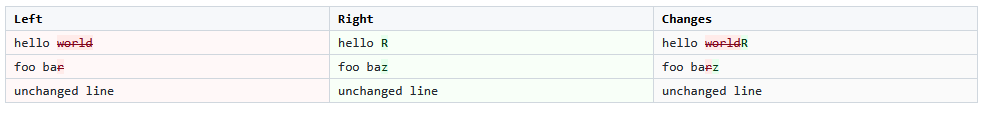

```r
# Word-level diff
diff_html(
  c("The quick brown fox", "Hello world"),
  c("The slow red fox",    "Hello R"),
  method = diff_words
)

# Line-level diff on multiline strings
diff_html(
  c("line 1\nline 2\nline 3"),
  c("line 1\nLINE 2\nline 3"),
  method = diff_lines
)

# Get the HTML string without opening a browser
html <- diff_html(
  c("a", "b", "c"),
  c("a", "B", "c"),
  view = FALSE
)
nchar(html)  # full HTML page as a string

# Write to a file manually
writeLines(html, "my_diff.html")

# Use with sentence-level diffs
diff_html(
  c("The cat sat. The dog ran."),
  c("The cat sat. The bird flew."),
  method = diff_sentences
)
```

**Column semantics:**

| Column | Contains |
|--------|----------|
| **Left** | Original text. Removed characters/words are shown with a red background and strikethrough. |
| **Right** | New text. Added characters/words are shown with a green background. |
| **Changes** | Combined inline diff: both additions and removals visible together. |

---

## 9. Format Conversion

### convert_changes_to_xml

Wraps additions in `<ins>` tags and deletions in `<del>` tags.

```r
ch <- diff_chars("Hello World", "Hello R World")
convert_changes_to_xml(ch)
# Hello <ins>R </ins>World

ch2 <- diff_words("the cat sat", "the dog sat")
convert_changes_to_xml(ch2)
# the <del>cat</del><ins>dog</ins> sat

# Useful for embedding in existing HTML documents
paste0("<p>", convert_changes_to_xml(diff_chars("v1.0", "v1.1")), "</p>")
# <p>v1.<del>0</del><ins>1</ins></p>
```

### convert_changes_to_dmp

Converts to Google's [diff-match-patch](https://github.com/google/diff-match-patch)
format: a list of `[operation, text]` pairs where the operation is
`-1` (delete), `0` (equal), or `1` (insert).

```r
ch <- diff_chars("Hello World", "Hello R World")
dmp <- convert_changes_to_dmp(ch)
str(dmp)
# List of 3
#  $ :List of 2
#   ..$ operation: int 0
#   ..$ value    : chr "Hello "
#  $ :List of 2
#   ..$ operation: int 1
#   ..$ value    : chr "R "
#  $ :List of 2
#   ..$ operation: int 0
#   ..$ value    : chr "World"

# Inspect
for (part in dmp) {
  label <- switch(as.character(part[[1]]), "-1" = "DELETE", "0" = "EQUAL", "1" = "INSERT")
  cat(label, ": ", part[[2]], "\n", sep = "")
}
# EQUAL : Hello
# INSERT: R
# EQUAL :  World

# Word-level DMP output
dmp_words <- convert_changes_to_dmp(diff_words("cat sat", "dog sat"))
```

---

## 10. camelCase Aliases

Every function has a camelCase alias matching the original JavaScript jsdiff API.
The two forms are completely interchangeable.

| snake_case | camelCase |
|---|---|
| `diff_chars` | `diffChars` |
| `diff_words` | `diffWords` |
| `diff_words_with_space` | `diffWordsWithSpace` |
| `diff_lines` | `diffLines` |
| `diff_trimmed_lines` | `diffTrimmedLines` |
| `diff_sentences` | `diffSentences` |
| `diff_css` | `diffCss` |
| `diff_json` | `diffJson` |
| `diff_arrays` | `diffArrays` |
| `structured_patch` | `structuredPatch` |
| `format_patch` | `formatPatch` |
| `create_patch` | `createPatch` |
| `create_two_files_patch` | `createTwoFilesPatch` |
| `parse_patch` | `parsePatch` |
| `apply_patch` | `applyPatch` |
| `apply_patches` | `applyPatches` |
| `reverse_patch` | `reversePatch` |
| `convert_changes_to_xml` | `convertChangesToXML` |
| `convert_changes_to_dmp` | `convertChangesToDMP` |

```r
# These are identical:
diffChars("abc", "abd")
diff_chars("abc", "abd")

structuredPatch("f", "f", "old\n", "new\n")
structured_patch("f", "f", "old\n", "new\n")

parsePatch(createPatch("f", "old\n", "new\n"))
parse_patch(create_patch("f", "old\n", "new\n"))
```

---

## 11. Advanced Options

### one_change_per_token

By default adjacent changes of the same type are coalesced into a single row.
Set `one_change_per_token = TRUE` to get one row per token.

```r
# Default: coalesced
str(diff_chars("abcde", "axcye"))
# Classes 'jsdiff_changes', 'data.table' and 'data.frame':        7 obs. of  4 variables:
#  $ value  : chr  "a" "b" "x" "c" ...
#  $ added  : logi  FALSE FALSE TRUE FALSE FALSE TRUE ...
#  $ removed: logi  FALSE TRUE FALSE FALSE TRUE FALSE ...
#  $ count  : int  1 1 1 1 1 1 1

# one_change_per_token = TRUE behaves identically for chars,
# but matters more for word/line diffs with consecutive changes
str(diff_words(
  "a b c d",
  "a x y d",
  one_change_per_token = TRUE
))
# Classes 'jsdiff_changes', 'data.table' and 'data.frame':        6 obs. of  4 variables:
#  $ value  : chr  "a " " b " " c " " x " ...
#  $ added  : logi  FALSE FALSE FALSE TRUE TRUE FALSE
#  $ removed: logi  FALSE TRUE TRUE FALSE FALSE FALSE
#  $ count  : int  1 1 1 1 1 1
```

### Working with the changes data.table directly

`jsdiff_changes` is a `data.table` subclass, so all `data.table` operations apply.

```r
library(data.table)

ch <- diff_words("the quick brown fox jumps", "the slow brown fox leaps")

# Filter to only changed tokens
ch[added == TRUE | removed == TRUE]

# Reconstruct old string
paste0(ch[removed == TRUE | (added == FALSE & removed == FALSE), value], collapse = "")

# Reconstruct new string
paste0(ch[added == TRUE  | (added == FALSE & removed == FALSE), value], collapse = "")

# Check if two strings are identical
all(!ch$added & !ch$removed)

# Coerce to a plain data.table (drops jsdiff_changes class)
as.data.table(ch)
```
